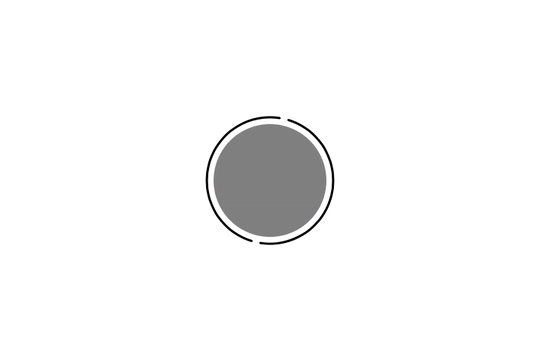

# DRAuraButton

[](https://travis-ci.org/Charles Thierry/DRAuraButton)
[](http://cocoapods.org/pods/DRAuraButton)
[](http://cocoapods.org/pods/DRAuraButton)
[](http://cocoapods.org/pods/DRAuraButton)

## Example

To run the example project, clone the repo, and run `pod install` from the Example directory first.

## Requirements

## Installation

DRAuraButton is available through a non official [CocoaPods](http://cocoapods.org) repository. To install
it, simply add the following lines to your Podfile:

```ruby
source 'https://github.com/DeRunco/cocoapods/'
pod "DRAuraButton"
```

## About


DRAuraButton is a UIButton with a subview that displays a rotating circle. Multiple configuration of stroke width, radius, color and speed can be specified. Going from one configuration to another is animated.

This project was done mainly as a first approch to Core Animation framework -- it uses `CABasicAnimation`s to animates transition between states.

#### Instantiate

Any storyboard button can be set to be a `DRAuraButton`. 

#### States

The button presents arbitrary states, defined by the developer.

A state is defined by a set of properties, stored in a `DRAuraConfiguration` object. Among those properties are the `ID`. It serves as state identifier (see `DRAuraButton.currentStateID`). All states must have a unique `ID`.

To create and add a new state, use `DRAuraButton` `addAuraConfiguration:` method: 

```ObjC
[myButton addAuraConfiguration:^(DRAuraConfiguration *c) {
	c.ID = @"my State name";
	c.width = 2.;
	c.space = 7.;
	c.offset = 6.;
	c.step = 0.04;
	c.animationDuration = 0.3;
	c.auraColor = [UIColor blackColor];
	c.buttonColor = [UIColor grayColor];
}];
```
To switch to that state, call `setCurrentStateID:` :

```ObjC
[myButton setCurrentStateID:@"my State name"];
```
To remove a state from the object, call `removeAuraConfiguration:` :

```ObjC
[myButton removeAuraConfiguration:@"my State name"];
```

#### Customizable properties

* Angle of rotation per frame: set `DRAuraConfiguration.step`. Greater is faster. Rotation is animated by NSTimer each 0.016s. As per NSTimer however, this time interval is not guaranteed.
* Space between the button and the circle: set `DRAuraConfiguration.space`. Greater is bigger
* Space between the top half and the bottom half: set `DRAuraConfiguration.offset`. This value is half the actual arc length between each arc.  
* Stroke width: set `DRAuraConfiguration.width`. Greater is wider.
* Color of the stroke: set `DRAuraConfiguration.auraColor`.
* Color of the button's background layer: set `DRAuraConfiguration.buttonColor`.


## License

DRAuraButton is available under the MIT license. See the LICENSE file for more info.
